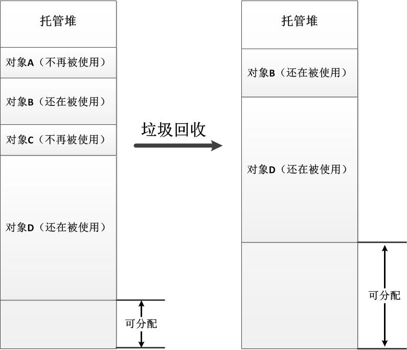
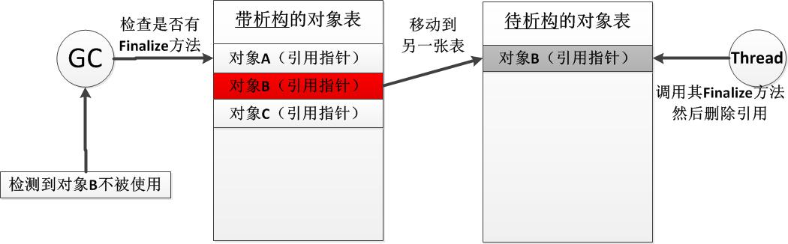

# 什么是内存
当提到一些带有GC的面向对象语言时, **内存**的概念与**物理内存**已经没有多大的关系了.

在操作系统层面, 系统为每个程序(进程)分配一块**虚拟内存空间**, 在程序眼中, 这块内存是他可以利用的所有资源. 而这块**虚拟内存空间**可能对应一些**一块块内存页**, 存放在物理内存或者硬盘中, 这其中的转换与管理被操作系统完全控制.

因此, C#的垃圾回收机制(GC), 所管理的内存空间, 就是操作系统分配的**虚拟内存空间**.

# .NET 的内存结构
> 此处开始, 不做特殊说明的情况下, 后文的**内存**都指的是**虚拟内存空间** 

dotnet程序的内存空间分为: 栈区 和 堆区, 其中堆区分为: 托管堆 和 非托管堆.

栈区会保存一些值类型, 以及引用类型的指针, 是一块连续的地址. 栈区的分配符合"先入后出"原则.

托管堆也是一块连续的内存空间, 得益于 .net 的内存机制, 托管堆的分配也是顺序的, 从低到高进行分配. 托管堆的内涵正是: "委托GC进行回收管理的堆", 因此 GC 主要的工作就是对托管堆进行管理.

非托管堆则完全由程序控制, 使用 unsafe 等手段, 可以手动申请内存, 此时会分配非托管堆的内存空间.

# 编译器优化

```c#
string mstring = 'aaa'+'bbb'+'ccc'
```

string是C#中的引用类型, 以上代码执行并不会生成临时的字符串对象, 编译器会直接创建 `aaabbbccc` 的字符串对象. 

# 垃圾回收机制
垃圾回收会自动释放托管堆中不在被引用的资源. 此外, 为了防止出现内存碎片, GC也会移动一些对象, 使他们靠近托管堆的某一边.



通常情况下, 开发者并不需要手动控制GC的执行, 但 dotnet 提供了 `GC.Collect()` 方法来手动执行垃圾回收过程. 当需要及时释放不被使用的内存时, 可以使用此方法. 但GC操作的代价很高, 需要遍历对象引用, 还涉及对象移动.

# Dispose 和 Finalize

1. Dispose 的调用完全由程序员决定. GC 并不会尝试执行该方法. 除了直接调用外, using 也会在结束时自动执行 Dispose 方法.
2. Finalize 相当于C++的析构函数. 定义方法也相同 `~ClassName()` .当一个引用对象拥有 Finalize 方法时, GC会在释放该对象时执行 Finalize 函数.

## GC处理 Finalize 的方式
1. 当每个包含Finalize方法的类型的实例对象被分配时，.NET会在一张特定的表结构中添加一个引用并且指向这个实例对象，暂且称该表为“带析构方法的对象表”；
2. 当GC执行并且检测到一个不被使用的对象时，需要进一步检查“带析构方法的对象表”来查询该对象类型是否含有Finalize方法，如果没有则将该对象视为垃圾，如果存在则将该对象的引用移动到另外一张表，暂且称其为“待析构的对象表”，并且该对象实例仍然被视为在被使用。
3. CLR将有一个单独的线程负责处理“待析构的对象表”，其执行方法内部就是依次通过调用其中每个对象的Finalize方法，然后删除引用，这时托管堆中的对象实例就被视为不再被使用。
4. **下一个GC执行时，将释放已经被调用Finalize方法的那些对象实例。**



以上机制说明了一个基本规律: 带有Finzlize的对象, 至少会经历GC的两次处理.

## 下面是两种资源管理范式

1. 只使用 Dispose 管理非托管资源.

```c#
public MyClass : IDisposable{

    void Dispose(){
        // 释放非托管资源
    }
}
```

2. 使用 Dispose 和 Finalize 实现标准资源释放模版. **注意 isDisposed 和 isDisposing 标记的不同**

```c#
public class MyClass : IDisposable{
    private bool isDisposed = false; // 标记非托管资源是否释放

    ~MyClass(){
        // GC 执行析构, 只需要处理非托管资源即可
        Dispose(false)
    }

    public void Method(){
        if(isDisposed){
            throw new ObjectDisposedException()
        }
    }

    public void Dispose(){
        Dispose(true);
        // GC 无需执行 Finalize
        GC.SuppressFinalize(this)
    }

    protected visual void Dispose(bool isDisposing){
        if(isDisposed){
            // 已释放
            return;
        }
        if(isDisposing){
            // 手动释放, 释放托管资源
        }
        // 释放非托管资源
        isDisposed = true;
    }
}

public sealed class SubClass : MyClass {
    private bool isDisposed = false;

    override void Dispose(bool isDisposing){
        if(isDisposed){
            return;
        }
        if(isDisposing){
            // 释放托管资源
        }
        // 释放非托管资源
        base.Dispose(isDisposing);
        isDisposed = true;
    }
}
```

真正做释放工作的只是受保护的虚方法Dispose，它接收一个bool参数，主要用于区分调用者是类型的使用者还是.NET的GC机制。两者的区别在于通过Finalize方法释放资源时不能再释放或使用对象中的托管资源，这是因为这时的对象已经处于不被使用的状态，很有可能其中的托管资源已经被释放掉了。在Dispose方法中GC.SuppressFinalize(this)告诉GC此对象在被回收时不需要调用Finalize方法，这一句是改善性能的关键，记住实现Dispose方法的本质目的就在于避免所有释放工作在Finalize方法中进行。

# 资源的"代generation"
GC每次执行内存回收时, 并不需要扫描托管堆的所有对象. 而是根据对象"可能不再被使用"分成3类, 称之为"代".

- 任何新创建的对象是 "0代"
- 在每次GC后依然保留的对象则代数加一, 最高为"3代"
- 每执行 N 次 0代 的回收, 才会执行一次 1代 的回收. 同样每执行 N 次 1代 的回收, 才会执行一次 2代 的回收.

比较反常的一点是, 代数越高说明在内存中保存时间越久, 但GC返回对他们降低扫描次数. 但这也是实践总结的规律: 
> **一个对象实例存活的时间越长，那么它就具有更大的机率去存活更长的时间。换句话说，最有可能马上就不被使用的对象实例，往往是那些刚刚被分配的对象实例，而且新分配的对象实例通常都会被马上大量地使用。**

因此, 我们应该及时将不再被使用的对象的引用置空, 来避免该对象被分到更高的"代"上. 

在前面我们提到Finalize方法会大幅影响性能，通过结合对代的理解，我们可以知道：在带有Finalize方法的对象被回收时，该对象会被视为正在被使用从而被留在托管堆中，且至少要等一个GC循环才能被释放（为什么是至少一个？因为这取决于执行Finalize方法的线程的执行速度）。很明显，需要执行Finalize方法的那些对象实例，被真正释放时最乐观的情况下也已经位于1代的位置上了，而如果它们是在1代上才开始释放或者执行Finalize方法的线程运行得慢了一点，那该对象就在第2代上才被释放，相对于0代，这样的对象实例在堆中存留的时间将长很多。

# GC的判断机制
在.NET中引用类型对象实例通常通过引用来访问，而GC判断堆中的对象是否仍然在被使用的依据也是引用。简单地说：当没有任何引用指向堆中的某个对象实例时，这个对象就被视为不再使用。

　　在GC执行垃圾回收时，会把引用分为以下两类：

1. 根引用：往往指那些静态字段的引用，或者存活的局部变量的引用；
2. 非根引用：指那些不属于根引用的引用，往往是对象实例中的字段。

　　垃圾回收时，GC从所有仍在被使用的根引用出发遍历所有的对象实例，那些不能被遍历到的对象将被视为不再被使用而进行回收。

# 内存泄漏和优化
首先，必须明确一点：即使在拥有垃圾回收机制的.NET托管堆上，仍然是有可能发生内存泄露现象的。

　　其次，什么是内存泄露？内存泄露是指内存空间上产生了不再被实际使用却又不能被分配的内存空间，其意义很广泛，像内存碎片、不彻底的对象释放等都属于内存泄露现象。内存泄露将导致主机的内存随着程序的运行而逐渐减少，无论其表现形式怎样，它的危害是很大的，因此我们需要努力地避免。

　　按照内存泄露的定义，我们可以知道在大部分的时候.NET中的托管堆中存在着短暂的内存泄露情况，因为对象一旦不再被使用，需要等到下一个GC时才会被释放。这里列举几个在.NET中常见的几种对系统危害较大的内存泄露情况，我们在实际开发中需要极力避免：

## 大对象的分配
.NET中所有的大对象（这里主要是指对象的大小超过指定数值[85000字节]）将分配在托管堆内一个特殊的区域内，暂且将其称为“大对象堆”（这也算是CLR对于GC的一个优化策略）。大对象堆中最重要的一个特点就是：没有代级的概念，所有对象都被视为第2代。在回收大对象堆内的对象时，其他的大对象不会被移动，这是考虑到大规模地移动对象需要耗费过多的资源。这样，在程序过多地分配和释放大对象之后，就会产生很多内存碎片。

我们所需要做的就是**尽量减少大对象的分配次数**，尤其是那些作为局部变量的，将被大规模分配和释放的大对象，典型的例子就是String类型。

## 不恰当的使用根引用
最简单的一个错误例子就是不恰当地把一个对象申明为公共静态变量，一个公共的静态变量将一直被GC视为一个在使用的根引用。更糟糕的是：当这个对象内部还包含更多的对象引用时，这些对象同样不会被释放。

## 不正确的Finalize
前面已经介绍了Finalize方法时由GC的一个专用的线程进行调用，抛开Microsoft怎样实现的这个具体的调度算法，有一点可以肯定的是：不正确的Finalize方法将导致Finalize方法不能被正确执行。如果系统中所有的Finalize方法不能被正确执行，包含它们的对象也只能驻留在托管堆内不能被释放，这样的情况将会导致严重的后果。

那么，什么是不正确的Finalize方法？Finalize方法应该只致力于快速而简单地释放非托管资源，并且尽可能快地返回。相反，不正确的Finalize方法则可能包含以下这样的一些代码：

1. 没有保护地写文件日志；
2. 访问数据库；
3. 访问网络；
4. 把当前对象赋给某个存活的引用；

例如，当Finalize方法试图访问文件系统、数据库或者网络时，将会有资源争用和等待的潜在危险。试想一个不断尝试访问离线数据库的Finalize方法，将会在长时间内不会返回，这不仅影响了对象的释放，也使得排在Finalize方法队列中的所有后续对象得不到释放，这个连锁反应将会导致很快地造成内存耗尽。此外，如果在Finalize方法中把对象自身又赋给了另外一个存活的引用，这时对象内的一部分资源已经被释放掉了，而另外一部分还没有，当这样一个对象被激活后，将导致不可预知的后果。
