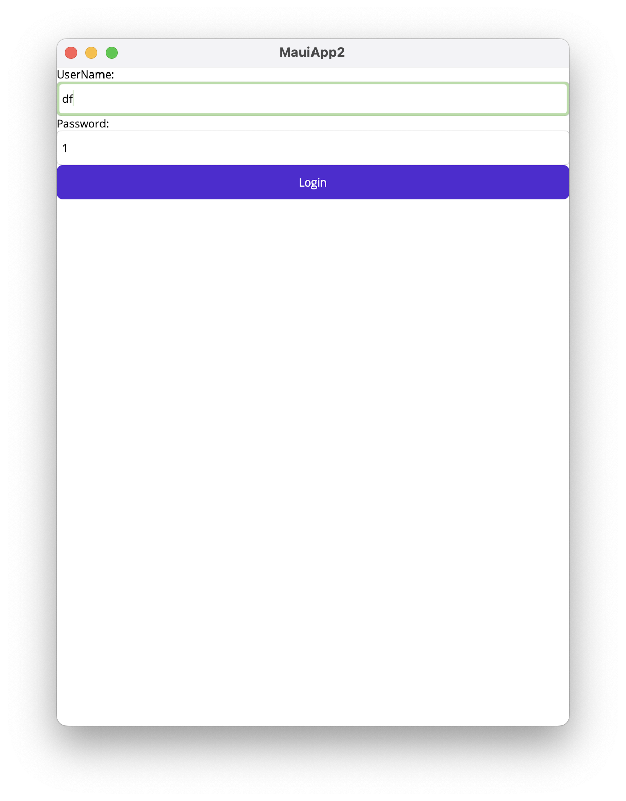
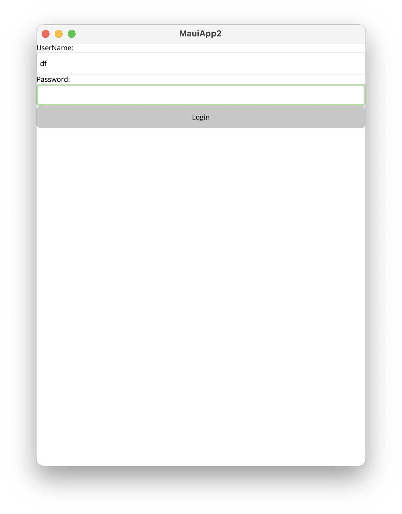

> PS.微软的官方文档的中文翻译,简直依托史,牛头不对马嘴的.只好啃英文文档,这里做个记录.


功能: 可观测对象 命令 的基本实现

## 可观测对象

可观测对象是指，在对象属性发生更改时，对订阅者提供通知。

Mvvm工具包提供了三种可观测对象：

1. ObservableObject 
2. ObservableRecipient
3. ObservableValidator


### ObservableObject

该类实现了了基本的 `INotifyProperty` 系列接口，只要继承该类，就可以获得可观测功能。

```c#
// 1. 直接声明可观测数据类型
public class User : ObservableObject
{
  private string name;
  public string Name{
    get=>name;
    set=>SetProperty(ref name, value);	// 使用父类提供的方法修改属性
  }
}
// 2. 将已有的普通模型（例如数据库实体模型）“包装”成新的可观测类型
public class ObservableUser : ObservableObject
{
  private readonly User user; // User是一个数据库实体模型
  public ObservableUser(User user) => this.User=user;
  public string Name{
    get=>user.Name;
    set=>SetProperty(user.Name, value, user, (u, n) => u.Name = n) // 
  }
}
// 3. 异步任务
public class MyModel : ObservableObject
{
    private TaskNotifier<int>? requestTask;
    public Task<int>? RequestTask
    {
        get => requestTask;
        set => SetPropertyAndNotifyOnCompletion(ref requestTask, value);
    }

    public void RequestValue()
    {
        RequestTask = WebService.LoadMyValueAsync();	// 当设置Task属性时，经过Set方法，Task被包装为TaskNotifier，这将在异步任务完成后，对绑定目标进行通知。
    }
}
```


### ObservableRecipient

除了可以提供属性更改通知，还可以接受来自其他可观测类的通知。

这里就用最方便的写法，通过继承接口省去手动注册的麻烦.

```c#
public sealed class PostWidgetViewModel : ObservableRecipient, IRecipient<PropertyChangedMessage<object>>
{
    private object post;

    /// <summary>
    /// Gets the currently selected post, if any.
    /// </summary>
    public object Post
    {
        get => post;
        private set => SetProperty(ref post, value);
    }

    /// <inheritdoc/>
    public void Receive(PropertyChangedMessage<object> message)
    {
        if (message.Sender.GetType() == typeof(SubredditWidgetViewModel) &&
            message.PropertyName == nameof(SubredditWidgetViewModel.SelectedPost))
        {
            Post = message.NewValue;
        }
    }
}
```


### ObservableValidator

在设置属性时进行属性验证。

```c#
// 1. 简单使用
public class RegistrationForm : ObservableValidator
{
    private string name;

    [Required]
    [MinLength(2)]
    [MaxLength(100)]
    public string Name
    {
        get => name;
        set => SetProperty(ref name, value, true); // 第三个参数指明是否需要验证
    }
}
// 2. 自定义验证器
public class RegistrationForm : ObservableValidator
{
    private readonly IFancyService service;

    public RegistrationForm(IFancyService service)
    {
        this.service = service;
    }

    private string name;

    [Required]
    [MinLength(2)]
    [MaxLength(100)]
    [CustomValidation(typeof(RegistrationForm), nameof(ValidateName))] // 使用
    public string Name
    {
        get => this.name;
        set => SetProperty(ref this.name, value, true);
    }
		// 自定义验证器
    public static ValidationResult ValidateName(string name, ValidationContext context)
    {
        RegistrationForm instance = (RegistrationForm)context.ObjectInstance;
        bool isValid = instance.service.Validate(name);

        if (isValid)
        {
            return ValidationResult.Success;
        }

        return new("The name was not validated by the fancy service");
    }
}
// 3. 自定义验证器（属性，为了避免混淆，这里改称“标记”）
// [GraterThan(A)] 假如给与属性B标记，则验证条件为 B>A
public sealed class GreaterThanAttribute : ValidationAttribute
{
    public GreaterThanAttribute(string propertyName)
    {
        PropertyName = propertyName;
    }
		// 这里可以获取到标记的成员名称 A
    public string PropertyName { get; }

    protected override ValidationResult IsValid(object value, ValidationContext validationContext)
    {
        object
            instance = validationContext.ObjectInstance,
            otherValue = instance.GetType().GetProperty(PropertyName).GetValue(instance);
				// 这里的 value 是被标记的实例（B） other是A
        if (((IComparable)value).CompareTo(otherValue) > 0)
        {
            return ValidationResult.Success;
        }

        return new("The current value is smaller than the other one");
    }
}
```


## 命令

将方法包装成命令，支持函数、委托、异步任务等。

```c#
public class MyViewModel : ObservableObject
{
    public MyViewModel()
    {
        DownloadTextCommand = new AsyncRelayCommand(DownloadText);
    }

    public IAsyncRelayCommand DownloadTextCommand { get; }

    private Task<string> DownloadText()
    {
        return WebService.LoadMyTextAsync();
    }
}
```


## 源生成器

生成器可以帮助生成重复代码，比如可以使用“属性标记”来创建可观测属性，创建命令等。

```c#
// 在属性上使用 可观测属性 标记
[ObservableProperty]
// 使用通知标记 可以通知属性 命令
[NotifyPropertyChangedFor(nameof(FullName))]
// 发送属性更改广播
[NotifyPropertyChangedRecipients]
// 标记转发，在新生成的Name属性上添加标记
[property: JsonRequired]
[property: JsonPropertyName("name")]
private string? name;

// 在方法上使用 命令 标记
[RelayCommand] // 也支持异步方法 支持带参数方法
[RelayCommand(CanExecute=nameof(SelectedUser))] // 将“是否可执行该命令”绑定到属性或方法
[RelayCommand(AllowConcurrentExecutions=true)] // 是否允许并发执行
private void GreetUser(User? user){
	Console.WriteLine($"Hello {user!.Name}!");
}
[ObservableProperty]
// 属性更改时通知命令
[NotifyCanExecuteChangedFor(nameof(GreetUserCommand))]
private User? selectedUser;
```


最后三个对现有类型进行“可观察”的改造的属性

`INotifyPropertyChanged ObservableObject ObservableRecipient`

给类型冠以以上标记，将类型改为“partial”即可。


## 例子

这里简单以一个登录Form做例子，只有用户名和密码都有值的时候，登录按钮才可用，否则灰色不可用。


1. 创建 LoginViewModel

```C#
public partial class LoginViewModel : ObservableRecipient
{
    [ObservableProperty]
    [NotifyCanExecuteChangedFor(nameof(LoginCommand))]
    private string _username = string.Empty;
    [ObservableProperty]
    [NotifyCanExecuteChangedFor(nameof(LoginCommand))]
    private string _password = string.Empty;

    [RelayCommand(CanExecute = nameof(CanLogin))]
    private Task Login()
    {
        var res = HttpClientSingleton.HttpClientSingleton.PostAsync<LoginInfo>("Main/Login", new LoginInfo{Username = Username, Password = Password});
        
        return null;
    }

    private bool CanLogin()
    {
        return !string.IsNullOrEmpty(Username) && !string.IsNullOrEmpty(Password);
    }

    public class LoginInfo
    {
        public string Username { get; set; }
        public string Password { get; set; }
    }
}
```

解释一下，CanExecute是一个验证命令是否可执行的属性。他和绑定的组件有互动，这里就是按钮。CanExecute可以绑定方法，也可以绑定属性。

为`_username _password`指定了通知标记，当两个属性发生变化是，会通知到`LoginCommand`，并触发`CanExecute`验证。

2. 进行绑定

```XML
<?xml version="1.0" encoding="utf-8"?>

<ContentPage xmlns="http://schemas.microsoft.com/dotnet/2021/maui"
             xmlns:x="http://schemas.microsoft.com/winfx/2009/xaml"
             x:Class="MauiApp2.LoginPage"
             xmlns:local="clr-namespace:MauiApp2.ViewModels"
             BindingContext="{RelativeSource Self}">
    <ContentPage.BindingContext>
        <local:LoginViewModel/>
    </ContentPage.BindingContext>
    <ContentPage.Content>
        <VerticalStackLayout>
            <Label Text="UserName: "/>
            <Entry x:Name="UserNameEntry" Text="{Binding Username}"></Entry>
            <Label Text="Password: "/>
            <Entry x:Name="PasswordEntry" Text="{Binding Password}"></Entry>
            <Button Text="Login" Command="{Binding LoginCommand}"></Button>
        </VerticalStackLayout>
    </ContentPage.Content>
</ContentPage>
```

很常规的绑定写法，在View中进行ViewModel的初始化。当然也可以用依赖注入的方式。这个不会影响生成器正常工作。

3. 效果如下





